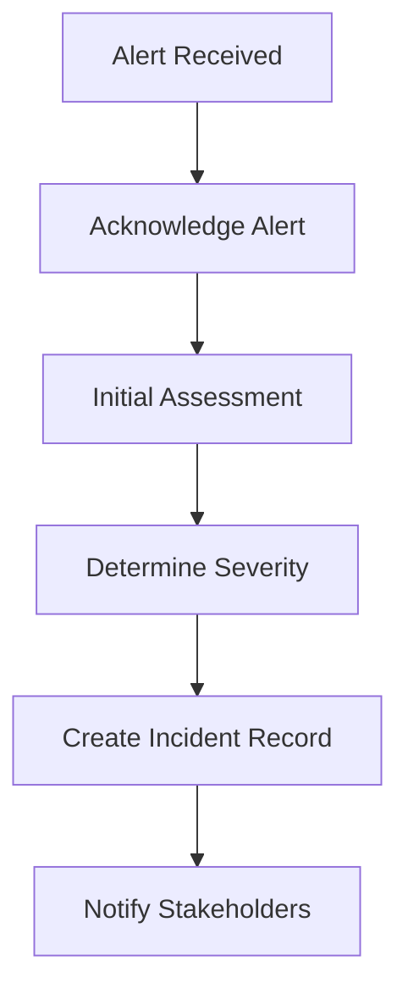

# 🚨 TenderFlow Incident Response Runbook

## Overview

This runbook provides step-by-step procedures for responding to incidents in the TenderFlow platform. It ensures consistent, effective response to maintain our 99.9% uptime SLA and government compliance requirements.

## Alert Severity Levels

| Severity | Response Time | Description | Examples |
|----------|---------------|-------------|----------|
| **CRITICAL** | 15 minutes | Service unavailable, data loss risk | API down, database unreachable, security breach |
| **HIGH** | 30 minutes | Major functionality impacted | High error rates, severe performance degradation |
| **MEDIUM** | 2 hours | Degraded performance, some users affected | Moderate latency increase, partial feature failure |
| **LOW** | 24 hours | Minor issues, monitoring alerts | Resource usage warnings, non-critical errors |

## Emergency Contacts

- **On-Call Engineer**: +1-XXX-XXX-XXXX
- **Engineering Manager**: +1-XXX-XXX-XXXX  
- **Security Team**: security@tenderflow.app
- **Government Liaison**: compliance@tenderflow.app
- **CEO/CTO**: executives@tenderflow.app

## General Incident Response Process

### 1. Incident Detection (0-5 minutes)



**Actions:**
1. **Acknowledge** the alert in monitoring system
2. **Create** incident record in incident management system
3. **Assess** initial impact and scope
4. **Classify** severity level
5. **Notify** appropriate stakeholders based on severity

### 2. Investigation & Diagnosis (5-30 minutes)

**Critical Investigation Steps:**
1. Check service health dashboards
2. Review recent deployments or changes
3. Examine error logs and metrics
4. Verify external dependencies
5. Test affected functionality

**Key Monitoring URLs:**
- Main Dashboard: `https://console.cloud.google.com/monitoring/dashboards/custom/tenderflow-main`
- Error Reporting: `https://console.cloud.google.com/errors`
- Cloud Logging: `https://console.cloud.google.com/logs/query`
- Service Health: `https://status.tenderflow.app`

### 3. Mitigation & Resolution (Varies by severity)

**Immediate Actions:**
1. Implement quick fixes or workarounds
2. Scale resources if capacity-related
3. Rollback if caused by recent deployment
4. Isolate affected components if necessary

### 4. Communication & Documentation

**During Incident:**
- Update incident record every 30 minutes
- Communicate status to stakeholders
- Post public status page updates if user-facing

**Post-Resolution:**
- Document root cause analysis
- Create improvement action items
- Update runbooks if needed
- Conduct post-mortem for CRITICAL/HIGH incidents

---

## Specific Incident Response Procedures

### 🔴 CRITICAL: API Service Unavailable

**Alert:** `SLO Alert: API Availability < 99.9%`

#### Immediate Response (0-5 minutes)
1. **Check Cloud Run service status**
   ```bash
   gcloud run services describe tenderflow-api --region=us-central1
   ```

2. **Verify load balancer health**
   ```bash
   gcloud compute backend-services get-health websocket-backend --global
   ```

3. **Check database connectivity**
   ```bash
   gcloud sql operations list --instance=tenderflow-db --limit=5
   ```

#### Investigation Steps (5-15 minutes)
1. **Review recent deployments**
   - Check last deployment time
   - Compare with incident start time
   - Review deployment logs

2. **Analyze error patterns**
   - Filter Cloud Logging: `resource.type="cloud_run_revision" severity>=ERROR`
   - Check Error Reporting dashboard
   - Look for common error patterns

3. **Check resource utilization**
   - CPU/Memory usage spikes
   - Database connection counts
   - Redis memory usage

#### Mitigation Actions
1. **If caused by recent deployment:**
   ```bash
   # Rollback to previous version
   gcloud run services update tenderflow-api \
     --image=gcr.io/tensurv/tenderflow-api:previous-stable \
     --region=us-central1
   ```

2. **If resource exhaustion:**
   ```bash
   # Scale up instances
   gcloud run services update tenderflow-api \
     --max-instances=100 \
     --region=us-central1
   ```

3. **If database issues:**
   - Check Cloud SQL status
   - Review connection pool settings
   - Consider read replica failover

#### Success Criteria
- API health check returns 200
- Error rate drops below 0.1%
- Response time under 2 seconds

---

### 🟡 HIGH: High Error Rate

**Alert:** `SLO Alert: Error Rate > 1%`

#### Investigation Checklist
- [ ] Check Error Reporting for top errors
- [ ] Analyze error distribution by endpoint
- [ ] Review database query performance
- [ ] Check external service dependencies
- [ ] Verify authentication service health

#### Common Causes & Solutions

**Database Connection Errors:**
```sql
-- Check active connections
SELECT count(*) FROM pg_stat_activity WHERE state = 'active';

-- Check slow queries
SELECT query, mean_exec_time, calls 
FROM pg_stat_statements 
ORDER BY mean_exec_time DESC 
LIMIT 10;
```

**JWT Token Issues:**
```bash
# Check JWT secret rotation
kubectl get secret jwt-secret -o yaml

# Verify token validation logs
gcloud logging read 'resource.type="cloud_run_revision" jsonPayload.event="jwt_validation_failed"' --limit=50
```

**External Service Failures:**
- Check third-party service status pages
- Review API timeouts and retry logic
- Implement circuit breaker if needed

---

### 🟠 MEDIUM: WebSocket Connection Issues

**Alert:** `SLO Alert: WebSocket Connection Drop Rate > 5%`

#### Investigation Steps
1. **Check Redis cluster health**
   ```bash
   gcloud redis instances describe websocket-cluster --region=us-central1
   ```

2. **Verify WebSocket service scaling**
   ```bash
   gcloud run services describe tenderflow-websocket --region=us-central1
   ```

3. **Review connection patterns**
   - Check connection duration metrics
   - Analyze disconnection reasons
   - Review client-side error logs

#### Common Issues & Fixes

**Redis Connection Issues:**
- Check Redis memory usage
- Verify authentication credentials
- Review connection timeout settings

**Load Balancer Session Affinity:**
- Verify session affinity configuration
- Check for instance replacement patterns
- Review connection migration logs

**Client Network Issues:**
- Check for mobile/unstable connections
- Review retry logic on client side
- Implement connection recovery mechanisms

---

### 🔴 CRITICAL: Database Performance Degradation

**Alert:** `SLO Alert: Database Query Time > 1s (90th percentile)`

#### Immediate Actions
1. **Check Cloud SQL insights**
   ```bash
   gcloud sql operations list --instance=tenderflow-db --limit=10
   ```

2. **Identify slow queries**
   ```sql
   SELECT query, mean_exec_time, calls, total_exec_time
   FROM pg_stat_statements 
   WHERE mean_exec_time > 1000  -- > 1 second
   ORDER BY mean_exec_time DESC 
   LIMIT 20;
   ```

3. **Check for blocking queries**
   ```sql
   SELECT blocked_locks.pid AS blocked_pid,
          blocked_activity.usename AS blocked_user,
          blocking_locks.pid AS blocking_pid,
          blocking_activity.usename AS blocking_user,
          blocked_activity.query AS blocked_statement
   FROM pg_catalog.pg_locks blocked_locks
   JOIN pg_catalog.pg_stat_activity blocked_activity ON blocked_activity.pid = blocked_locks.pid
   JOIN pg_catalog.pg_locks blocking_locks ON blocking_locks.locktype = blocked_locks.locktype
   JOIN pg_catalog.pg_stat_activity blocking_activity ON blocking_activity.pid = blocking_locks.pid
   WHERE NOT blocked_locks.granted;
   ```

#### Mitigation Strategies
1. **Terminate long-running queries** (if safe)
2. **Scale database resources** temporarily
3. **Enable read replicas** for read traffic
4. **Implement query timeouts** in application
5. **Add database connection pooling** if not present

---

### 🔴 CRITICAL: Security Incident

**Alert:** `Security Alert: High Authentication Failure Rate`

#### ⚠️ IMMEDIATE SECURITY RESPONSE ⚠️

1. **Isolate the threat** (0-5 minutes)
   ```bash
   # Block suspicious IPs at load balancer
   gcloud compute security-policies rules create 1000 \
     --security-policy=websocket-security-policy \
     --expression="origin.ip == 'SUSPICIOUS_IP'" \
     --action=deny-403
   ```

2. **Gather forensic evidence** (5-15 minutes)
   - Export authentication logs
   - Capture network traffic logs
   - Document attack patterns
   - Preserve system state

3. **Notify security team** (Immediately)
   - Email: security@tenderflow.app
   - Phone: Emergency security hotline
   - Include: Attack vector, scope, initial assessment

4. **Government notification** (Within 24 hours)
   - Contact: compliance@tenderflow.app
   - Prepare incident summary
   - Document impact assessment
   - Coordinate with legal team

#### Investigation Commands
```bash
# Check authentication failure patterns
gcloud logging read 'resource.type="cloud_run_revision" jsonPayload.event="auth_failed"' \
  --limit=1000 --format="table(timestamp,jsonPayload.source_ip,jsonPayload.reason)"

# Analyze IP address patterns
gcloud logging read 'resource.type="cloud_run_revision" jsonPayload.event="auth_failed"' \
  --limit=5000 --format="value(jsonPayload.source_ip)" | sort | uniq -c | sort -nr

# Check for privilege escalation attempts
gcloud logging read 'resource.type="cloud_run_revision" jsonPayload.event="authorization_failed"' \
  --limit=1000
```

---

## Post-Incident Procedures

### 1. Immediate Post-Resolution (Within 2 hours)
- [ ] Verify all systems are fully operational
- [ ] Remove any temporary workarounds
- [ ] Update incident status to resolved
- [ ] Notify stakeholders of resolution
- [ ] Begin initial root cause analysis

### 2. Post-Mortem Process (Within 24 hours for CRITICAL)

**Post-Mortem Template:**
```markdown
# Incident Post-Mortem: [Date] - [Brief Description]

## Incident Summary
- **Start Time:** 
- **End Time:**
- **Duration:**
- **Severity:**
- **Impact:**

## Timeline
- HH:MM - Incident began
- HH:MM - Alert triggered
- HH:MM - Investigation started
- HH:MM - Root cause identified
- HH:MM - Fix implemented
- HH:MM - Service restored

## Root Cause Analysis
### Primary Cause:
### Contributing Factors:

## Resolution
### Immediate Fix:
### Permanent Fix:

## Lessons Learned
### What Went Well:
### What Could Be Improved:

## Action Items
- [ ] Action 1 - Owner - Due Date
- [ ] Action 2 - Owner - Due Date

## Prevention Measures
```

### 3. Follow-up Actions (Within 1 week)
- [ ] Complete all action items
- [ ] Update monitoring and alerting
- [ ] Revise runbooks if needed
- [ ] Share learnings with team
- [ ] Government reporting if required

---

## Escalation Matrix

### Technical Escalation
1. **On-Call Engineer** → 2. **Senior Engineer** → 3. **Engineering Manager** → 4. **CTO**

### Business Escalation
1. **Engineering Manager** → 2. **VP Engineering** → 3. **CEO**

### Government/Compliance Escalation
1. **Compliance Officer** → 2. **Legal Counsel** → 3. **Government Liaison**

---

## Tools & Resources

### Monitoring & Dashboards
- **Main Dashboard**: [Link]
- **Service Health**: [Link]
- **Error Reporting**: [Link]
- **Performance Metrics**: [Link]

### Communication Channels
- **Incident Slack**: #incidents
- **Engineering Slack**: #engineering
- **Status Page**: https://status.tenderflow.app

### Documentation
- **Architecture Docs**: `/docs/ARCHITECTURE.md`
- **Deployment Guide**: `/docs/deployment/`
- **API Documentation**: [Link]

### Emergency Procedures
- **Rollback Guide**: `/docs/rollback-procedures.md`
- **Scaling Guide**: `/docs/scaling-procedures.md`
- **Security Response**: `/docs/security-incident-response.md`

---

## Testing & Maintenance

### Monthly Runbook Testing
- [ ] Simulate common incident scenarios
- [ ] Verify alert notifications work
- [ ] Test escalation procedures
- [ ] Update contact information
- [ ] Review and update procedures

### Continuous Improvement
- Incorporate lessons from real incidents
- Update based on system architecture changes
- Align with industry best practices
- Regular training for team members

---

*Last Updated: [Date]*  
*Next Review: [Date + 3 months]*  
*Version: 1.0*